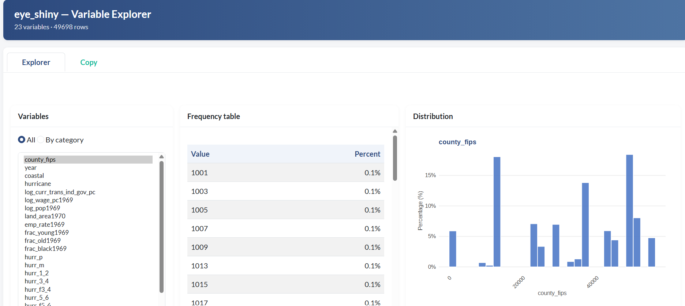
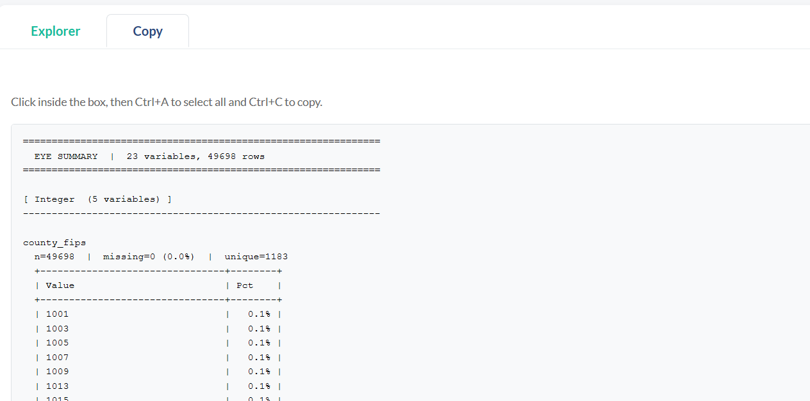

# rFunctions

Personal R utility package — a growing collection of helper functions for data exploration and analysis.

- GitHub: <https://github.com/simfavot99/rFunctions>
- Issues: <https://github.com/simfavot99/rFunctions/issues>

------------------------------------------------------------------------

## Installation

``` r
# install.packages("devtools")
devtools::install_github("simfavot99/rFunctions")
```

------------------------------------------------------------------------

## `eye_shiny` — Interactive Variable Explorer

Launches a Shiny app that lets you explore every variable in a data frame at a glance: frequency tables, distribution plots, and a plain-text summary you can copy and paste.

``` r
eye_shiny(df)              # default: show up to 50 unique values
eye_shiny(df, max_n = 100)
```

### Explorer tab

Three-column layout: pick a variable on the left, read its frequency table in the middle, and inspect its distribution on the right.



- **Variable list** — toggle between *All* (flat) and *By category* (grouped by type: Integer, Numeric, Character, Factor, Logical, Date).
- **Frequency table** — values ordered from most to least frequent, with percentage and a colour-bar indicator. Capped at `max_n` (default 50).
- **Distribution plot** — interactive (hover for exact values). Integer/Numeric → histogram with % y-axis. Character/Factor/Logical → horizontal bar chart. Date → daily count timeline.

> A yellow warning banner appears automatically when all unique values share the same frequency.

### Copy tab

A read-only monospaced text area with the top 30 most frequent values + percentage for **every** variable, grouped by type. Click inside, press **Ctrl+A**, then **Ctrl+C**.



### Arguments

| Argument | Default | Description |
|-----------------------|---------------------|-----------------------------|
| `data` | — | A data frame to explore. |
| `max_n` | `50` | Max unique values in the Explorer table and bar chart. The Copy tab always uses 30, independently. |

**Dependencies:** `shiny`, `bslib`, `ggiraph`, `ggplot2`, `DT` (installed automatically via `pacman` if missing).

------------------------------------------------------------------------

## `structure_of_dataset` — Dataset Structure Explorer

Prints a compact overview of any data frame: dimensions, a `glimpse()`, a per-variable summary table, and frequency tables for every variable.

``` r
structure_of_dataset(df)
```

### Output

1. **Dimensions + glimpse** — row/column count followed by `dplyr::glimpse()`.
2. **Summary table** — one row per variable with: `type`, `n_unique`, `n_missing`, `pct_missing`, and `min` / `mean` / `median` / `max` (NA for non-numeric columns).
3. **Frequency tables** — for each variable, up to 15 most frequent values with their count and percentage. A note is shown when all unique values share the same frequency.

### Arguments

| Argument | Default | Description |
|----------|---------|-------------|
| `df` | — | A data frame to explore. |

**Dependencies:** `dplyr`, `purrr` (installed automatically via `pacman` if missing).